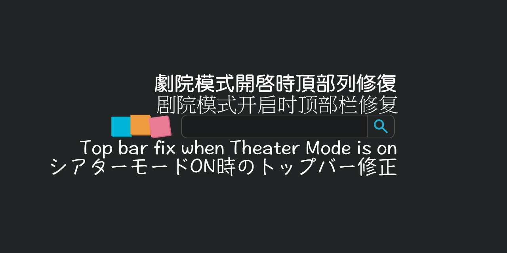

# [B.M] 動畫瘋 劇院模式頂部列修正

[](https://developer.chrome.com/docs/extensions/mv3/)
[](https://ani.gamer.com.tw)
[](LICENSE)

適用於 [巴哈姆特動畫瘋](https://ani.gamer.com.tw)（`ani.gamer.com.tw`）的瀏覽器擴充功能：在 **劇院（全螢幕）模式** 下，修正網站 **頂部導覽列** 於 **暫停、停止載入或播畢後無法再次顯示** 的問題；播放進行中仍維持與官方相同的隱藏行為，不會因滑鼠掠過而強制拉出頂欄。

*English: In **theater mode** on Bahamut Anime Crazy (`ani.gamer.com.tw`), fixes the **top bar not reappearing** after **pause, stop (emptied), or end of playback**; while playing, hiding stays aligned with the official site.*

> **聲明**：本專案為第三方輔助工具，與動畫瘋／巴哈姆特官方無關。使用請遵守該站服務條款與著作權規範。



---

## 目錄

- [功能](#功能)
- [系統需求](#系統需求)
- [安裝方式](#安裝方式)
- [本機開發與測試](#本機開發與測試)
- [技術概要](#技術概要)
- [專案結構](#專案結構)
- [版本與多語系](#版本與多語系)
- [隱私](#隱私)
- [維護者：更新 GitHub 與 Chrome 線上應用程式商店](#維護者更新-github-與-chrome-線上應用程式商店)
- [授權](#授權)
- [問題與建議](#問題與建議)

## 功能

- 在劇院模式且影片 **暫停**、**ended（播畢）** 或 **emptied（停止載入）** 時，讓網站 **`.top_sky`** 頂部區塊恢復可見（透過 [`content.css`](content.css) 覆寫 `fullwindow` 位移）。
- 避免播放器 **`.vjs-title-bar`** 在暫停／結束時卡在透明狀態（同見 [`content.css`](content.css)）。
- 僅在 **`https://ani.gamer.com.tw/*`** 載入；[`manifest.json`](manifest.json) 未宣告 `host_permissions`，不額外請求其他網域。
- 若動畫瘋改版 DOM／class，可能需調整 [`content.js`](content.js) 的選取與同步邏輯。

## 系統需求

- **Chrome** 或 **Microsoft Edge**（Chromium）等支援 **Manifest V3** 的瀏覽器。

## 安裝方式

### 從 Chrome 線上應用程式商店（建議）

請在 [Chrome Web Store](https://chromewebstore.google.com/) 搜尋 **「[B.M] 動畫瘋 劇院模式頂部列修正」**，或使用開發者提供的商店連結安裝。

### 從原始碼載入（開發人員模式）

1. 點選本頁綠色 **Code** → **Download ZIP** 解壓，或 `git clone` 本儲存庫。
2. 開啟 Chrome 或 Edge，前往 `chrome://extensions`（Edge：`edge://extensions`）。
3. 開啟「開發人員模式」→「載入未封裝項目」→ 選取含 [`manifest.json`](manifest.json) 的**專案根目錄**。
4. 開啟動畫瘋任一有影片的頁面，切換 **劇院模式（T）**，暫停或播畢後確認頂部列可再次顯示。

## 本機開發與測試

修改 [`content.js`](content.js)／[`content.css`](content.css) 後，在 `chrome://extensions` 對本擴充按 **重新載入**，再重新整理動畫瘋分頁即可驗證。

## 技術概要

- **內容腳本** [`content.js`](content.js) 在符合網址的頁面執行：監聽影片 `play`／`pause`／`ended`／`emptied` 等事件，並以 **MutationObserver** 因應 DOM 變化，對 **`.top_sky`** 切換輔助 class。
- **樣式** [`content.css`](content.css) 在暫停／結束等狀態下覆寫站方劇院模式對頂欄的位移，並修正 **`.vjs-title-bar`** 透明度。

## 專案結構

| 路徑 | 說明 |
|------|------|
| [`manifest.json`](manifest.json) | Manifest V3 設定、內容腳本比對網址 |
| [`content.js`](content.js) | 劇院模式偵測、影片事件與 DOM 同步 |
| [`content.css`](content.css) | 頂欄顯示與 title bar 相關樣式覆寫 |
| [`_locales/`](_locales/) | 擴充名稱與說明（`zh_TW`、`zh_CN`、`en`、`ja`） |
| [`privacy-policy.html`](privacy-policy.html) | 隱私權政策（上架時需提供可公開 HTTPS 網址） |
| [`icons/`](icons/) | 16／48／128 px 圖示 |
| [`screenshot/`](screenshot/) | 商店／說明用截圖（見下表） |

**Chrome Web Store 常用截圖尺寸**（本專案已備範例檔名）：

| 檔案 | 用途（約略） |
|------|----------------|
| `screenshot_440x280.png` | 小型宣傳圖 |
| `screenshot_1280x800.png` | 單一螢幕截圖（寬螢幕） |
| `screenshot_1280x640.png` | README／說明用 |
| `screenshot_1400x560.png` | 大型宣傳圖 |

## 版本與多語系

- 版本號：[`manifest.json`](manifest.json) 的 `version`。
- 預設語系：`zh_TW`（`default_locale`）。

## 隱私

本擴充**不蒐集、不上傳**個人資料；未使用分析或遠端程式碼。詳見 [`privacy-policy.html`](privacy-policy.html)。

**上架 Chrome Web Store 時**，後台須填寫隱私實踐，並提供該政策頁面的**公開 HTTPS URL**（可將 `privacy-policy.html` 託管於 [GitHub Pages](https://pages.github.com/) 等）。

## 維護者：更新 GitHub 與 Chrome 線上應用程式商店

### GitHub

於專案根目錄提交並推送即可，例如：

```bash
git add README.md
git commit -m "docs: 更新 README"
git push origin main
```

### Chrome 線上應用程式商店

須使用您的 [Chrome Web Store 開發人員控制台](https://chrome.google.com/webstore/devconsole) 操作，**本儲存庫無法代替您登入或送審**。

1. **遞增版本**：每次上傳新套件須提高 `manifest.json` 的 `version`（例如 `0.1.0` → `0.1.1`）。
2. **打包 ZIP**：根目錄須直接包含 `manifest.json`（勿多包一層資料夾）。建議只含：`manifest.json`、`content.js`、`content.css`、`privacy-policy.html`、`icons/`、`_locales/`。排除：`.git`、`.gitignore`、`screenshot/`、README、個人檔案、`*.zip`。
3. **上傳**：控制台選取項目 →「套件」→ 上傳新 ZIP。
4. **商店資產**：若有文案或截圖變更，一併更新說明與螢幕截圖（可參考 [`screenshot/`](screenshot/) 內檔案）。
5. **隱私權**：提供 `privacy-policy.html` 對應之公開 URL。
6. **提交審核**：審核通過後使用者才會收到更新。

首次上架另須完成 Google 開發人員註冊與一次性費用等（以 [官方說明](https://developer.chrome.com/docs/webstore/register) 為準）。

## 授權

本專案以 [MIT License](LICENSE) 授權。

## 問題與建議

歡迎使用 [GitHub Issues](https://github.com/BoringMan314/bm.ani.gamer.topbar.fix/issues) 回報錯誤或提出改善建議（請盡量附上瀏覽器版本、是否劇院模式與重現步驟）。
